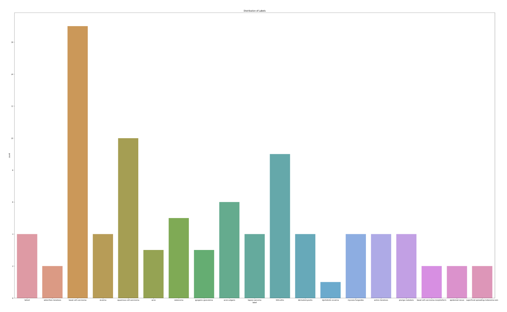
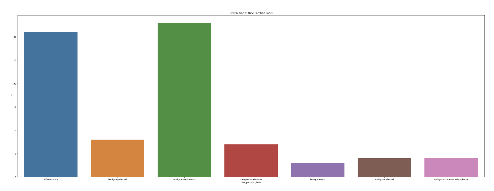
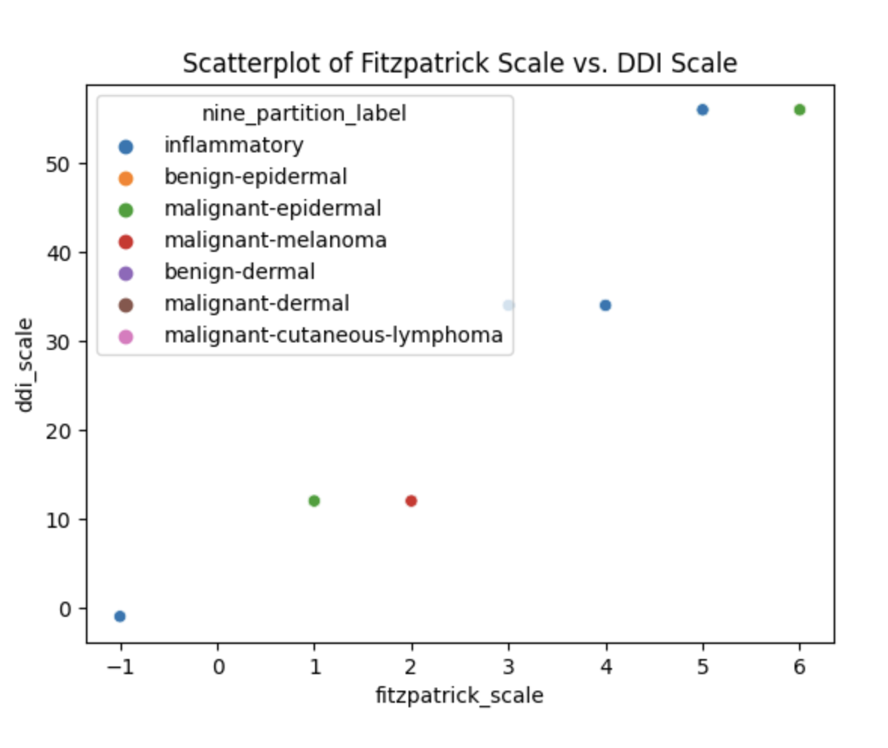

# AJL Team Selenium Equitable AI for Dermatology

---

### **👥 Team Members**

| Name | GitHub Handle | Contribution |
| ----- | ----- | ----- |
| Salma Bhar | @Salma-Bhar-CWRU | Built CNN model and optimizing with Vision Transformer (ViT) model |
| Iman Ikram | @ImanIkram | Built CNN model and optimizing with EfficientNetB3 model |
| Veronica Hangsan | @vhangsan | Built CNN model and optimizing with ResNet50 model |
| Adya Mohanty | @am2558 | Team Lead and Built CNN model |
| Ashley Nguyen | @ | Built CNN model |

---

## **🎯 Project Highlights**

**Example:**

* Built a \[insert model type\] using \[techniques used\] to solve \[Kaggle competition task\]
* Achieved an F1 score of \[insert score\] and a ranking of \[insert ranking out of participating teams\] on the final Kaggle Leaderboard
* Used \[explainability tool\] to interpret model decisions
* Implemented \[data preprocessing method\] to optimize results within compute constraints

🔗 [Equitable AI for Dermatology | Kaggle Competition Page](https://www.kaggle.com/competitions/bttai-ajl-2025/overview)
🔗 [WiDS Datathon 2025 | Kaggle Competition Page](https://www.kaggle.com/competitions/widsdatathon2025/overview)

---

## **👩🏽‍💻 Setup & Execution**

**Provide step-by-step instructions so someone else can run your code and reproduce your results. Depending on your setup, include:**

* How to clone the repository
* How to install dependencies
* How to set up the environment
* How to access the dataset(s)
* How to run the notebook or scripts

---

## **🏗️ Project Overview**

**Describe:**

* Background: Existing dermatology AI tools often fail to provide accurate diagnoses for individuals with darker skin tones due to insufficient diversity in training datasets. This limitation can result in diagnostic errors and delayed treatments. As a result, underserved communities are systematically excluded from the benefits of AI advancements in healthcare.

* Objective: We aim to develop a machine-learning model using datasets from Kaggle to classify 21 different skin conditions accurately. The model's performance will be evaluated through key metrics including accuracy, F1, and precision allowing us to gauge the model's ability to handle diverse skin tones.

---

## **📊 Data Exploration**

* Dataset Source: subset of the FitzPatrick17k dataset from Kaggle
* EDA approach: Visualizations (Label and Nine Partition Label Distribution, Scatterplot)
* Challenges:
  
During our data exploration analysis stage, we created visualizations to help understand the distribution of the different skin conditions.

* Visualization: This count plot shows the distribution of labels across the dataset and identifies the frequency of each class label.
  

* Visualization: This shows the distruibution of labels after partitioning the data into nine categories.
  

* Visualization: This scatter plot provides insights into correlations between the differrent skin conditions.

---

## **🧠 Model Development**

**Describe (as applicable):**

* Model(s) used (e.g., CNN with transfer learning, regression models)
* Feature selection and Hyperparameter tuning strategies
* Training setup (e.g., % of data for training/validation, evaluation metric, baseline performance)

---

## **📈 Results & Key Findings**

**Describe (as applicable):**

* Performance metrics (e.g., Kaggle Leaderboard score, F1-score)
* How your model performed overall
* How your model performed across different skin tones (AJL)
* Insights from evaluating model fairness (AJL)

**Potential visualizations to include:**

* Confusion matrix, precision-recall curve, feature importance plot, prediction distribution, outputs from fairness or explainability tools

---

## **🖼️ Impact Narrative**

**Answer the relevant questions below based on your competition:**

**WiDS challenge:**

1. What brain activity patterns are associated with ADHD; are they different between males and females, and, if so, how?
2. How could your work help contribute to ADHD research and/or clinical care?

**AJL challenge:**

As Dr. Randi mentioned in her challenge overview, “Through poetry, art, and storytelling, you can reach others who might not know enough to understand what’s happening with the machine learning model or data visualizations, but might still be heavily impacted by this kind of work.”
As you answer the questions below, consider using not only text, but also illustrations, annotated visualizations, poetry, or other creative techniques to make your work accessible to a wider audience.
Check out [this guide](https://drive.google.com/file/d/1kYKaVNR\_l7Abx2kebs3AdDi6TlPviC3q/view) from the Algorithmic Justice League for inspiration!

1. What steps did you take to address [model fairness](https://haas.berkeley.edu/wp-content/uploads/What-is-fairness_-EGAL2.pdf)? (e.g., leveraging data augmentation techniques to account for training dataset imbalances; using a validation set to assess model performance across different skin tones)
2. What broader impact could your work have?

---

## **🚀 Next Steps & Future Improvements**

**Address the following:**

* What are some of the limitations of your model?
* What would you do differently with more time/resources?
* What additional datasets or techniques would you explore?

---

## **📄 References & Additional Resources**

* Cite any relevant papers, articles, or tools used in your project

---

